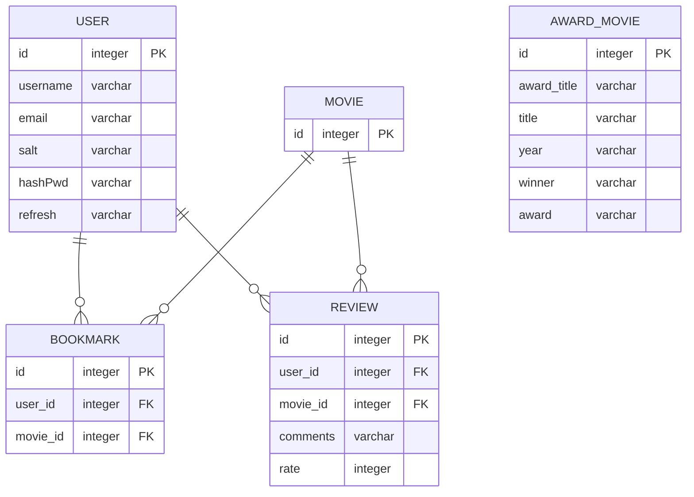

### BestMovies

---

# Back

## 1. ERD

- MOVIE는 오픈 API로 받아올 것

## 2. API 설계

## **수상작 영화 API**

- query : `year` or `award` or `전체`

|  | GET |
| --- | --- |
|  | '/awards' |
| Query | {year, award} |
| Response Body |  [{ "id": 1, "award_title": "황금종려상", "title": "아노라", "year": "2024", "winner": "션 베이커", "award": "cannes",“img” : “img-name”,“detail” : “detail…..”},{ }, …] |

## **USER API**

회원가입

1. username 빈 값인지
2. email : 이메일 형식인지
3. passworld : 8자 이상 

|  | POST |
| --- | --- |
|  | '/users/join' |
| Request Body |  {username, email, password} |
| Response Body | {"message": "회원가입 성공","result": result내용} |

로그인

- refresh 토큰은 DB에 저장됨 (user table)
- refresh 토큰은 쿠키로 보냄
- access 토큰은 body에 보냄

---

- 중복된 이메일로 가입시 → BAD_REQUEST

|  | POST |
| --- | --- |
|  | '/users/login' |
| Request Body |  { email, password} |
| Response Body | {"token": "eyJhbGciOiJIUzI1NiIsInR5cC….","refresh": result,"message": "Login success"} |

Refresh Token 재발급

- header의 authorization & refresh 빈 값인지 유효성검사
- body의 username, email 빈 값인지 유효성검사

|  | POST |
| --- | --- |
|  | '/users/refresh' |
| Request Header | req.headers.authorization // 현재 access token
req.headers.refresh; //현재 refresh token |
| Request Body |  {username, email} |
| Response Body | res.json({message : "새로운 토큰 발급 완료",token : accessToken…}); |
| refresh  token이 만료된 경우 | res.status(StatusCodes.UNAUTHORIZED).json({message : "다시 로그인 해주세요"}) |
| access token이 유효한 경우 | res.status(StatusCodes.BAD_REQUEST).json({message : "access token이 만료되지 않았습니다."}) |

---

## **BOOKMARK API**

- authorization을 통해 req에 저장된 req.user을 통해 email을 받아옴 (back에서 처리함)

개별 영화 좋아요 추가

- 존재하는 영화 아이디인지 확인 → 발생가능성?
- 유저-영화아이디 똑같은 쌍 존재 X → 발생가능성?(구현안함)

|  | POST |
| --- | --- |
|  | '/bookmarks' |
| Header | Authorization : access_token |
| Request Body |  {movie_id} |
| Response Body | res.json({message : "북마크 추가 성공!",user : req.user.email,movie: movie_id,result : result,}) |

개별 영화 좋아요 삭제

- 없는 영화 아이디 삭제 시 예외처리 → 발생가능성?

|  | DELETE |
| --- | --- |
|  | '/bookmarks' |
| Header | Authorization : access_token |
| Request Body |  {movie_id} |
| Response Body | res.json({message : "북마크 삭제 성공!",user : req.user.email,movie: movie_id,result : result,}) |

개별 영화 좋아요 조회

|  | GET |
| --- | --- |
|  | '/bookmarks' |
| Header | Authorization : access_token |
| Request Body |  |
| Response Body | [{ "movie_id": 1},{"movie_id": 2},…] |

**REVIEW API**

개별 영화 리뷰 및 평점 추가

|  | POST |
| --- | --- |
|  | '/reviews' |
| Header | Authorization : access_token |
| Request Body | {"movie_id" : 3,"content": "good","rating" : 4} |
| Response Body | {"message": "리뷰 추가 성공!","user": "mailto:moon@mail.com","movie": 3,"result": result} |

개별 영화 리뷰 및 평점 삭제

|  | DELETE |
| --- | --- |
|  | '/reviews' |
| Header | Authorization : access_token |
| Request Body |  |
| Response Body | {message : "리뷰 삭제 성공!", user : req.user.email, movie: movie_id, result : result} |

유저 개별 영화 리뷰 및 평점 수정

|  | PUT |
| --- | --- |
|  | '/reviews' |
| Header | Authorization : access_token |
| Request Body | {"movie_id" : 1, "content": "change comments22", "rating" : 4} |
| Response Body | {"message": "리뷰 수정 성공!","user": "mailto:apple@mail.com","movie": 1,"result": result} |

개별 영화 리뷰 및 평점 조회

|  | GET |
| --- | --- |
|  | '/reviews:movie_id' |
| Request Body |  |
| Response Body | [{"id": 4,"user_id": "mailto:blueberry@mail.com","movie_id": 2,"contents": "good","rating": 4},{"id": 5,"user_id": "mailto:apple@mail.com","movie_id": 2,"contents": "comments","rating": 2}] |

## 3. Authorization
