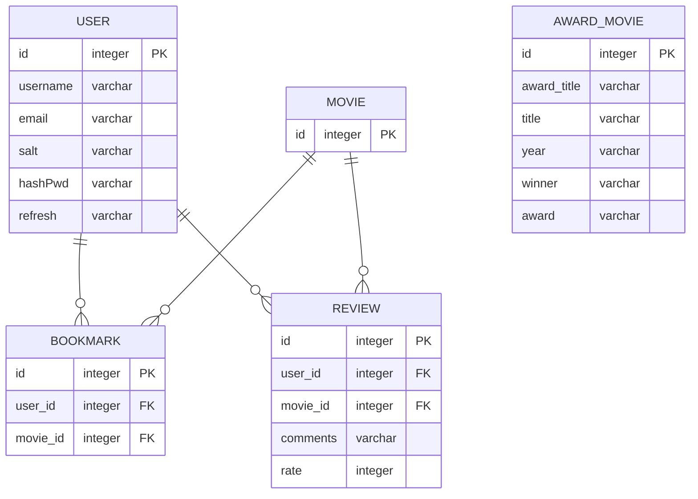

### BestMovies

---

# Back

## 1. ERD

- MOVIE는 오픈 API로 받아올 것

## 2. API 설계

### 수상작 영화 API

- DB에 담아놓은 영화 데이터 가져오기
- `GET`
- '/awards'
- `Request Query` = {year, award}
- `Response Body` = [ {
  "id": 1,
  "award_title": "황금종려상",
  "title": "아노라",
  "year": "2024",
  "winner": "션 베이커",
  "award": "cannes"
  }, ...]

### USER API

회원가입

- `POST`
- '/users/join'
- `Request Body` = {username, email, password}

로그인

- `POST`
- '/users/join'
- `Request Body` = {email, password}

### BOOKMARK API

- `POST` `DELETE`

### REVIEW API

`POST` `DELETE`

## 3. Authorization
